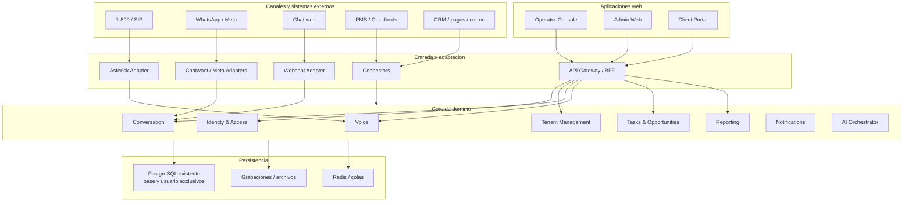
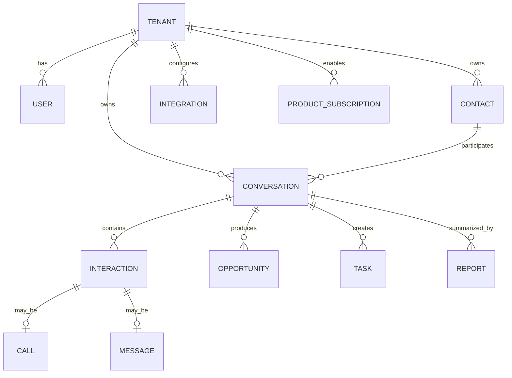

# Voxalia - Contexto Rector para IA

> Estado: documento rector inicial
> Version: 1.2
> Fecha: julio de 2026
> Raiz del proyecto: `/srv/voxalia`
> Tipo de repositorio: monorepo modular multi-tenant

## 1. Proposito

Este documento es la fuente base para cualquier agente de IA que analice,
disene o modifique Voxalia.

Cumple tres funciones:

1. Fijar la direccion de negocio y arquitectura.
2. Definir limites entre capas antes de escribir codigo.
3. Evitar que el proyecto herede accidentalmente acoplamientos de
   `/srv/datasyncsa`.

Antes de proponer cambios estructurales, una IA debe leer este archivo. Si
existen ADR en `/docs/adr`, debe leer solo los ADR relevantes para la tarea.

## 2. Que se esta construyendo

Voxalia no comienza como chatbot ni como plataforma autonoma de IA.

El primer producto es un servicio gestionado de atencion telefonica para
hoteles, operado por una agente humana trilingue. La tecnologia se construye
alrededor de esa operacion real y debe permitir crecer sin rehacer el nucleo.

### Primer servicio operativo

- Numero 1-800 para clientes de Estados Unidos y Canada.
- Trunk SIP y Asterisk.
- Atencion humana trilingue.
- Horarios, colas, enrutamiento y transferencias.
- Registro y grabacion de llamadas.
- Captura de contactos, solicitudes, oportunidades y tareas.
- Reportes para el hotel.
- Interfaz web para operacion, administracion y clientes.

### Evolucion prevista

1. Voz humana gestionada.
2. Atencion multicanal de chats.
3. Analisis posterior de llamadas mediante IA.
4. Asistencia de IA al operador humano.
5. Agentes de IA controlados para Meta y chat web.
6. Seguimiento comercial automatizado.
7. Integraciones con PMS, CRM, pagos y otros sistemas.
8. Nuevos productos y verticales.

La IA es una capacidad progresiva de la plataforma, no el centro del dominio.

## 3. Tesis central

El negocio comienza con atencion humana real. La plataforma debe nacer preparada
para voz, chat, IA, auditoria, seguimiento, integraciones y multiples
verticales, pero solo se implementara cada capacidad cuando exista una necesidad
operativa comprobada.

## 4. Bootstrap obligatorio por sesion

Antes de implementar, depurar o revisar codigo en `/srv/voxalia`:

1. Leer `.agent/AI_CONTEXT.md`.
2. Leer ADR relevantes en `/docs/adr` si existen.
3. Identificar la capa afectada por la tarea.
4. Revisar codigo existente solo en las rutas necesarias.
5. Si se cambia arquitectura, contratos, despliegue o reglas multi-tenant,
   registrar o proponer un ADR.

No copiar estructura, servicios ni patrones de `/srv/datasyncsa` salvo que el
usuario lo pida explicitamente o se reutilice una pieza concreta tras revisarla.

## 5. Principios arquitectonicos no negociables

| Principio | Aplicacion |
|---|---|
| Nucleo agnostico | Nada especifico de un hotel, cliente, vertical, canal o proveedor vive en el nucleo compartido. |
| Multi-tenancy desde el inicio | Toda entidad operativa relevante pertenece explicitamente a un `tenant_id`. |
| Monorepo modular | Se mantienen limites claros de codigo sin crear microservicios vacios. |
| APIs propias | Las interfaces web nunca acceden directamente a Asterisk, Chatwoot, Cloudbeds o PostgreSQL. |
| Eventos normalizados | El dominio trabaja con eventos propios, no con payloads nativos de proveedores. |
| Humano primero | La automatizacion se incorpora despues de observar la operacion real. |
| IA reemplazable | LangGraph, modelos y proveedores de IA son componentes sustituibles. |
| Configuracion antes que bifurcaciones | Diferencias entre clientes se resuelven con configuracion, politicas y plantillas. |
| Proveedores fuera del dominio | Estados e IDs externos se traducen en adaptadores o conectores. |
| Evolucion incremental | No se realizan refactorizaciones masivas sin necesidad verificable. |

### Regla de oro

Si aparece una condicion como esta dentro del nucleo compartido:

```python
if tenant == "hotel_x":
    ...
```

o esta:

```python
if vertical == "hospitality":
    ...
```

se debe detener el cambio y revisar donde pertenece realmente esa logica.

## 6. Arquitectura logica



Interpretacion:

- Las aplicaciones consumen APIs propias.
- Los canales traducen protocolos externos a eventos internos.
- Los conectores encapsulan proveedores especificos.
- El core conserva el dominio comun.
- Una llamada y un mensaje son tipos distintos de `Interaction` dentro de una
  misma `Conversation`.
- El contexto comercial debe poder continuar entre voz, WhatsApp y chat web.

## 7. Despliegue inicial

Las VMs ya existen. Voxalia se desarrollara desde cero en una VM disponible.

Decision actual:

```text
/srv/datasyncsa   # repositorio legado, conservado como respaldo
/srv/voxalia      # nuevo monorepo limpio
```

La VM de aplicacion podra contener, segun necesidad:

- Docker Compose.
- Asterisk.
- Redis o colas.
- Chatwoot para omnicanal.
- PostgreSQL si se decide operarlo localmente en la VM.
- APIs, workers y aplicaciones web propias solo cuando su implementacion o
  despliegue lo justifique.
- Adaptadores y conectores.

PostgreSQL usara la instancia existente con:

- Base de datos exclusiva.
- Usuario exclusivo.
- Permisos separados.
- Backups independientes.
- Acceso restringido por red.

No se creara una VM PostgreSQL nueva sin una razon operativa demostrable.

## 8. Estrategia de repo

La estructura objetivo representa limites logicos. Al inicio no implica crear
un microservicio, contenedor o despliegue independiente por cada carpeta.

Se debe comenzar como monorepo modular o pocos procesos desplegables. Un modulo
solo se extrae a servicio independiente cuando tenga contratos maduros y una
razon operativa clara.

Estructura objetivo:

```text
/srv/voxalia
├── .agent/
│   └── AI_CONTEXT.md
├── apps/
│   ├── admin-web/
│   ├── client-portal/
│   └── operator-console/
├── services/
│   ├── api/
│   ├── worker/
│   └── voice-runtime/
├── channels/
│   ├── asterisk-adapter/
│   ├── chatwoot-adapter/
│   ├── meta-adapter/
│   └── webchat-adapter/
├── products/
│   ├── managed-reception/
│   ├── multichannel-inbox/
│   ├── agent-assist/
│   ├── automated-chat/
│   ├── call-intelligence/
│   └── sales-followup/
├── verticals/
│   ├── hospitality/
│   └── _template/
├── connectors/
│   ├── cloudbeds/
│   ├── generic-pms/
│   ├── crm/
│   ├── payments/
│   └── email/
├── packages/
│   ├── domain/
│   ├── events/
│   ├── api-contracts/
│   ├── auth/
│   ├── observability/
│   └── config/
├── infra/
│   ├── compose/
│   ├── asterisk/
│   ├── wireguard/
│   ├── reverse-proxy/
│   ├── deploy/
│   └── backup/
├── docs/
│   ├── architecture/
│   ├── adr/
│   └── operations/
├── tests/
├── .env.example
├── compose.yml
└── README.md
```

No es obligatorio crear todos estos directorios desde el primer commit. La
estructura se materializa segun aparezcan capacidades reales.

## 9. Responsabilidad de cada capa

### `apps`

Interfaces de usuario.

No deben:

- contener reglas centrales;
- acceder directamente a PostgreSQL;
- comunicarse directamente con Asterisk o proveedores;
- decidir permisos como fuente autoritativa.

### `services`

Procesos ejecutables propios de Voxalia: API, workers, runtime de voz u otros
procesos necesarios. Pueden contener varios modulos internos si eso mantiene
simple el despliegue inicial.

### `channels`

Traducen protocolos y eventos externos a contratos internos.

Ejemplos:

- Asterisk AMI/ARI a `call.started`;
- Chatwoot webhook a `message.received`;
- chat web a `conversation.started`.

No contienen reglas comerciales del hotel.

### `products`

Definen que combinacion de capacidades se vende y habilita para un tenant.

Ejemplos:

- recepcion gestionada;
- bandeja multicanal;
- auditoria de llamadas;
- seguimiento comercial.

### `verticals`

Contienen lenguaje, politicas y workflows propios de una industria.

Ejemplo: `verticals/hospitality`.

Aqui pertenecen:

- politicas de reservas;
- intencion hotelera;
- prompts de hoteleria;
- workflows de huespedes;
- esquemas propios del sector.

### `connectors`

Implementan comunicacion con proveedores especificos.

Ejemplos:

- Cloudbeds;
- HubSpot;
- Zoho;
- pagos;
- correo.

### `packages`

Contratos, tipos, utilidades y reglas comunes sin logica especifica de cliente.

### `infra`

Configuracion versionada para ejecutar y operar la plataforma.

Incluye:

- Compose;
- Asterisk;
- WireGuard;
- proxy;
- despliegues;
- scripts de backup.

No incluye:

- creacion de VMs ya existentes;
- credenciales reales;
- grabaciones;
- respaldos;
- datos productivos.

## 10. Modelo de dominio minimo

Entidades centrales:

- `Tenant`
- `User`
- `Role`
- `Contact`
- `Conversation`
- `Interaction`
- `Call`
- `Message`
- `Opportunity`
- `Task`
- `Report`
- `Integration`
- `ProductSubscription`

Relacion conceptual:



Convencion de base de datos:

- Usar esquemas PostgreSQL por dominio cuando aporte claridad.
- Evitar prefijos redundantes en todas las tablas.
- Toda tabla con datos de clientes debe incluir `tenant_id` cuando corresponda.

Ejemplos:

```text
identity.users
tenancy.tenants
conversation.contacts
conversation.conversations
conversation.interactions
voice.calls
voice.recordings
sales.opportunities
workflow.tasks
reporting.reports
integration.connections
ai.executions
```

## 11. Contratos y eventos internos

Eventos iniciales previstos:

```text
call.started
call.answered
call.completed
recording.available
message.received
message.sent
conversation.assigned
human_handoff.requested
opportunity.detected
task.created
report.generated
integration.failed
```

Todo evento debe incluir, como minimo:

```json
{
  "event_id": "uuid",
  "event_type": "call.completed",
  "event_version": 1,
  "tenant_id": "uuid",
  "occurred_at": "ISO-8601",
  "source": "asterisk-adapter",
  "correlation_id": "uuid",
  "payload": {}
}
```

Los eventos no deben exponer estructuras internas completas de proveedores.

Antes de conectar dos modulos, definir:

- nombre del evento o endpoint;
- version;
- payload minimo;
- errores esperados;
- comportamiento multi-tenant;
- pruebas de contrato.

## 12. Aplicaciones web iniciales

### Operator Console

Debe evolucionar para mostrar:

- llamadas activas;
- identificacion del tenant/hotel;
- contexto del contacto;
- guiones;
- notas;
- tareas;
- resultado de llamada;
- seguimientos;
- sugerencias de IA cuando se habiliten.

### Admin Web

Debe permitir:

- tenants;
- usuarios;
- roles;
- productos;
- numeros;
- horarios;
- colas;
- permisos;
- integraciones;
- politicas de retencion;
- configuracion operativa.

### Client Portal

Debe permitir al cliente consultar, segun permisos:

- llamadas;
- contactos;
- oportunidades;
- reportes;
- grabaciones autorizadas;
- metricas;
- tareas;
- configuraciones permitidas.

Regla de comunicacion:

```text
Apps web
   -> HTTPS / WebSocket / SSE
API Gateway o BFF
   -> Servicios o modulos de dominio
   -> Adaptadores, conectores y persistencia
```

## 13. Estrategia de IA

Orden de incorporacion:

1. Transcripcion posterior a la llamada.
2. Resumen y extraccion estructurada.
3. Deteccion de intencion, oportunidades y seguimientos.
4. Asistencia al operador.
5. RAG por tenant/vertical.
6. Automatizacion limitada de chats.
7. Flujos transaccionales con PMS o CRM.

Limites obligatorios:

- La IA no decide permisos ni aislamiento entre tenants.
- Toda salida estructurada se valida con esquemas.
- Los prompts pertenecen a productos o verticales.
- LangGraph invoca servicios o conectores mediante contratos.
- Los agentes no consultan libremente tablas internas.
- Se registra modelo, prompt, herramientas, fuentes, costo y resultado.
- Toda automatizacion debe tener reglas claras de handoff humano.

## 14. Hoja de ruta

| Fase | Resultado |
|---|---|
| 0 - Fundaciones | Monorepo, compose base, API inicial, autenticacion, multi-tenancy, contratos, observabilidad, CI/CD y despliegue reproducible. |
| 1 - Voz humana | 1-800, SIP, Asterisk, softphone, horarios, colas, grabacion, Operator Console, contactos, notas y reportes basicos. |
| 2 - Multicanal | Chatwoot y texto; contactos, conversaciones y tareas unificadas. |
| 3 - Inteligencia posterior | STT, resumenes, clasificacion, oportunidades, alertas y reportes. |
| 4 - Asistencia humana | RAG, traduccion, sugerencias y preparacion de respuestas. |
| 5 - Chat automatizado | FAQs y captura de datos con handoff auditable. |
| 6 - Integraciones | PMS, CRM, pagos y seguimiento transaccional. |
| 7 - Productizacion | Planes, productos activables, metricas por tenant y nuevas verticales. |

## 15. Primer release operativo

El primer release debe ser deliberadamente pequeno. Debe probar que la operacion
telefonica real funciona y queda registrada con aislamiento por tenant.

### MVP operativo minimo

Debe incluir:

- un tenant piloto;
- capacidad real de agregar mas tenants sin cambiar codigo;
- numero 1-800 y trunk SIP;
- Asterisk y softphone;
- agente humana;
- identificacion de tenant/hotel en la llamada;
- captura de contacto;
- notas y resultado de llamada;
- metadatos de llamada;
- grabacion o referencia segura a grabacion;
- reporte basico para el hotel;
- roles minimos;
- aislamiento por tenant;
- logs con correlation ID;
- alertas operativas basicas.

### Puede esperar

No es obligatorio en el primer release:

- LangGraph completo;
- agentes autonomos;
- Cloudbeds;
- marketplace;
- facturacion automatica;
- multiples verticales;
- microservicios separados por dominio;
- portal cliente avanzado;
- dashboards complejos.

## 16. Criterios para extraer un microservicio

Un modulo solo debe convertirse en servicio independiente si:

- necesita escalar de forma distinta;
- requiere disponibilidad propia;
- tiene requisitos de seguridad particulares;
- usa tecnologia o recursos diferentes;
- su despliegue bloquea otros modulos;
- posee limites de dominio estables;
- sus contratos ya estan maduros.

La decision actual es comenzar como monolito modular o pocos procesos
desplegables, no como una constelacion de microservicios.

## 17. Seguridad y operacion

- Credenciales fuera del repositorio.
- Secretos cifrados cuando aplique.
- Autorizacion por tenant y rol.
- Evaluar RLS en PostgreSQL.
- Politicas de retencion de grabaciones y transcripciones.
- Auditoria de accesos y reproducciones.
- Backups con restauracion probada.
- WireGuard para infraestructura privada.
- Separacion entre datos, audio y telemetria.
- Avisos de grabacion configurables por tenant y jurisdiccion.
- Correlation IDs en logs y eventos.
- Ningun archivo `.env` real en Git.

## 18. Metricas rectoras

Operacion:

- llamadas recibidas;
- contestadas;
- abandonadas;
- tiempo de respuesta;
- duracion;
- ocupacion del agente.

Comercial:

- consultas calificadas;
- oportunidades;
- seguimientos;
- reservas atribuidas;
- valor estimado.

Calidad:

- cumplimiento de guion;
- errores;
- quejas;
- transferencias;
- correcciones.

IA:

- precision de extraccion;
- aceptacion de sugerencias;
- handoffs;
- errores;
- costo por interaccion.

Plataforma:

- disponibilidad;
- latencia;
- fallos de integracion;
- colas atrasadas;
- uso por tenant.

## 19. Prueba para decidir donde vive una funcionalidad

Antes de crear codigo, responder:

1. Es valida para todos los productos y verticales?
   Puede pertenecer a `services` o `packages`.
2. Depende de hoteleria?
   Pertenece a `verticals/hospitality`.
3. Define una oferta comercial activable?
   Pertenece a `products`.
4. Traduce un canal?
   Pertenece a `channels`.
5. Habla con un proveedor concreto?
   Pertenece a `connectors`.
6. Solo afecta presentacion?
   Pertenece a `apps`.
7. Es exclusiva de un cliente?
   Debe resolverse mediante configuracion del tenant. Si exige codigo, revisar
   el diseno.

## 20. Reglas obligatorias para agentes de IA

Toda IA que trabaje en este repositorio debe:

1. Leer `.agent/AI_CONTEXT.md` antes de implementar, depurar o revisar.
2. Identificar la capa afectada.
3. No introducir logica de cliente en el dominio comun.
4. No introducir detalles de proveedores en entidades centrales.
5. No crear microservicios sin justificarlo.
6. No acceder a PostgreSQL desde interfaces web o adaptadores.
7. Definir o actualizar contratos antes de conectar modulos.
8. Mantener `tenant_id` en operaciones de datos de clientes.
9. Agregar pruebas de aislamiento y contratos cuando haya codigo ejecutable.
10. Registrar decisiones relevantes en `/docs/adr`.
11. Proponer cambios incrementales y reversibles.
12. Senalar contradicciones con este documento antes de escribir codigo.
13. No copiar arquitectura accidental desde `/srv/datasyncsa`.
14. Reutilizar selectivamente componentes maduros si se revisan primero.
15. No modificar `/srv/datasyncsa` como parte del desarrollo de Voxalia salvo
    instruccion explicita.

Formato esperado de una propuesta de cambio:

```text
Objetivo:
Capa afectada:
Modulos afectados:
Contrato nuevo o modificado:
Impacto multi-tenant:
Riesgos:
Pruebas:
Migracion:
Rollback:
```

## 21. Decisiones actuales

```yaml
project_name: Voxalia
repository_root: /srv/voxalia
legacy_repository: /srv/datasyncsa
architecture: modular_monorepo
initial_deployment_shape: modular_monolith_or_few_processes
deployment_start: existing_vm
database: existing_postgresql_instance
database_isolation: dedicated_database_and_user
initial_market: boutique_hospitality
initial_product: managed_reception
initial_channel: voice
voice_stack:
  - toll_free_1800
  - sip_trunk
  - asterisk
  - softphone
human_operator_first: true
second_channel: multichannel_chat
future_inbox: chatwoot
future_pms: cloudbeds
ai_first_use:
  - post_call_transcription
  - summarization
  - structured_extraction
  - operator_assistance
```

## 22. Convenciones de nombres

```text
Proyecto:        Voxalia
Raiz:            /srv/voxalia
Repositorio:     voxalia
Base de datos:   voxalia
Paquete Python:  voxalia
Prefijo Docker:  voxalia-
Prefijo env:     VOXALIA_
```

Ejemplos:

```text
voxalia-api
voxalia-worker
voxalia-voice
voxalia-web
VOXALIA_DATABASE_URL
VOXALIA_ENV
VOXALIA_SECRET_KEY
```

Para IDs externos legibles se pueden usar:

```text
ten_
usr_
con_
int_
cal_
msg_
opp_
tsk_
```

## 23. Criterio de exito arquitectonico

La arquitectura habra funcionado cuando:

- un hotel nuevo se incorpore principalmente mediante configuracion;
- un canal nuevo se agregue sin reescribir conversaciones y oportunidades;
- un PMS se sustituya mediante otro conector;
- un producto se active combinando capacidades existentes;
- una nueva vertical se anada sin contaminar el nucleo;
- la IA pueda cambiarse sin alterar el dominio;
- el primer producto pueda operar de manera sencilla sin desplegar componentes
  futuros innecesarios.

## 24. Directiva final

Favorecer siempre la solucion mas simple que preserve los limites del dominio.
No sobredisenar, pero tampoco aceptar atajos que mezclen clientes, verticales,
canales, productos o proveedores dentro del nucleo.
